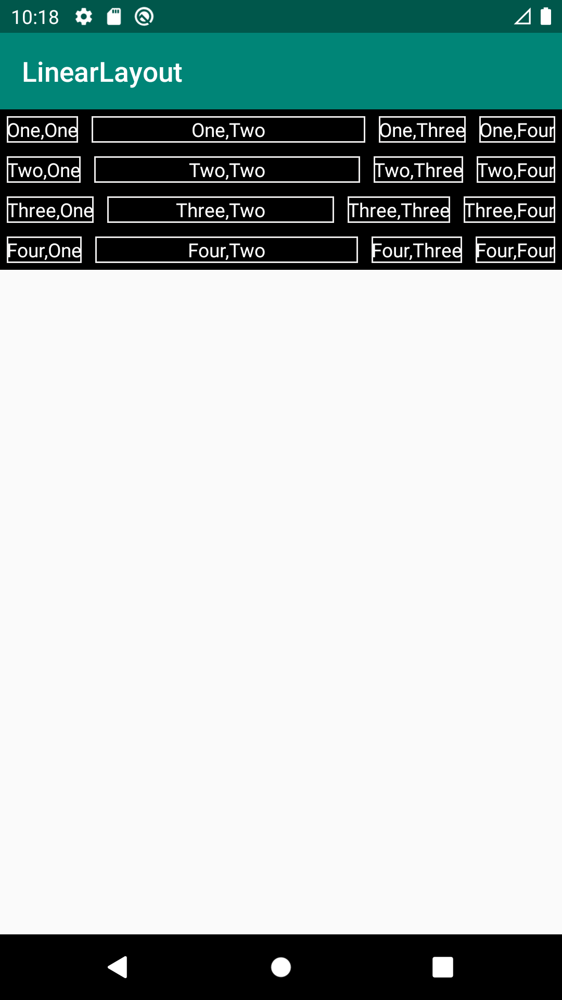
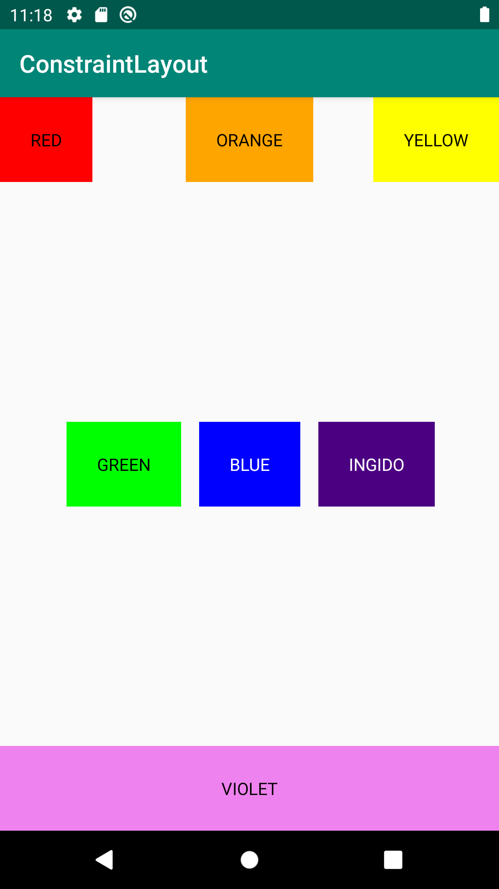
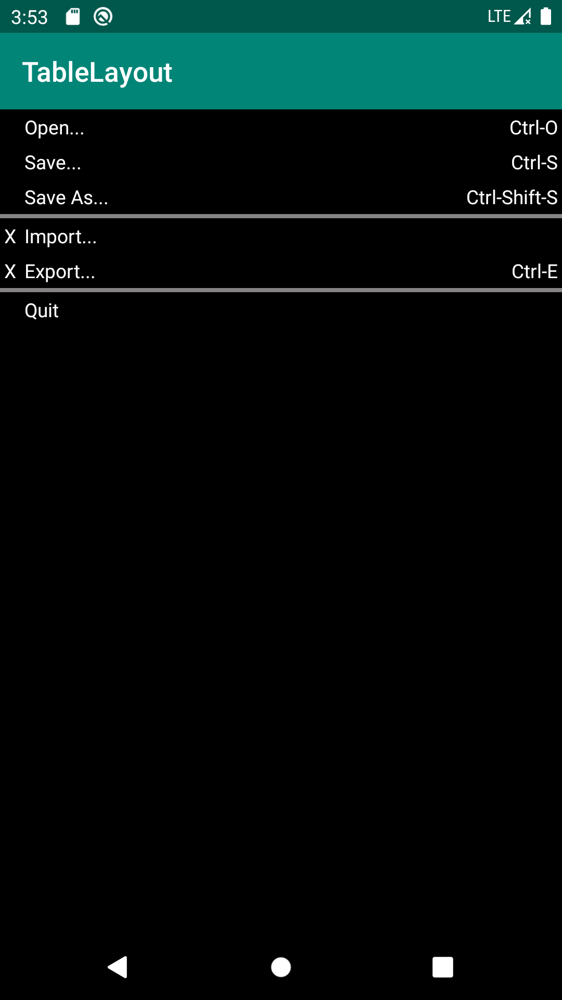

# 一、LinearLayout

## [**activity_main.xml**](https://github.com/zhanshiping/MyAndroid/blob/master/Lab2/LinearLayout/app/src/main/res/layout/activity_main.xml)

除了正常的线性布局操作外这里使用了textview_border.xml定义了一个白色边框，使用 android:background="@drawable/textview_border"来调用白色边框。

# 二、ConstraintLayout

## [**activity_main.xml**](https://github.com/zhanshiping/MyAndroid/blob/master/Lab2/ConstraintLayout/app/src/main/res/layout/activity_main.xml)

RED、ORANGE、YELLOW、BLUE、VIOLET相对于parent来定位

GREEN、INGIDO相对BLUE来定位

# 三、TableLayout

## [**activity_main.xml**](https://github.com/zhanshiping/MyAndroid/blob/master/Lab2/TableLayout/app/src/main/res/layout/activity_main.xml)

使用 <TableRow>一行一行来写，XX在0列。"Open..."、"Save..."、

"Save As..."、"Import..."、"Export..."、"Quit"、"Quit"在第一列。

"Ctrl-O"、"Ctrl-S"、"Ctrl-Shift-S"、"Ctrl-E"使用  android:gravity="right"定义在相应行的右边

