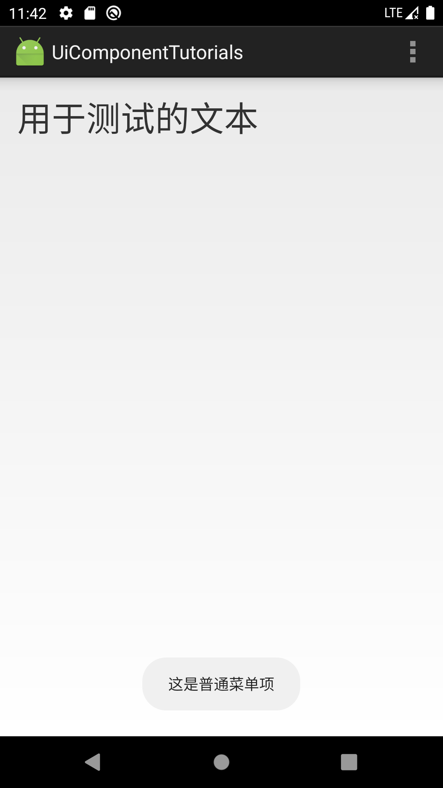

# Android UI 
## 一、导航页面

SimpleAdapterDemo演示SimpleAdapter的用法

CustomDialogDemo演示自定义对话框的实现

XmlMenuDemo演示如何使用xml文件定义菜单

AcitonModeContextDemo演示如何使用ACtionMode形式的上下文菜单

 

## 二、SimpleAdapter

## 三、自定义对话框

自定义对话框使用getLayoutInflater()获取LayoutInflater实例，然后利用LayoutInflater的inflate()方法从自定义布局文件中加载对话框的布局，从而实现自定义对话框。

## 四、使用XML定义菜单

## 五、创建ActionMode模式的上下文菜单

