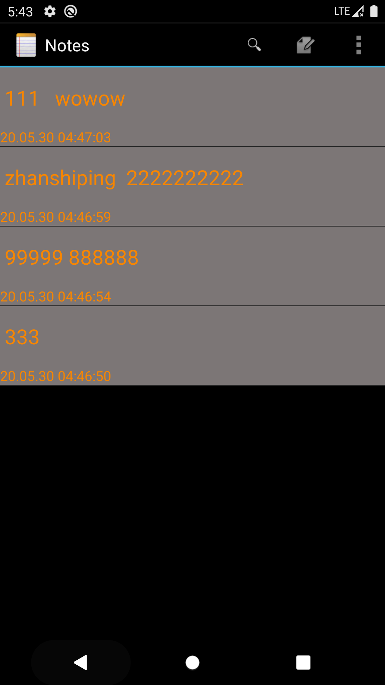
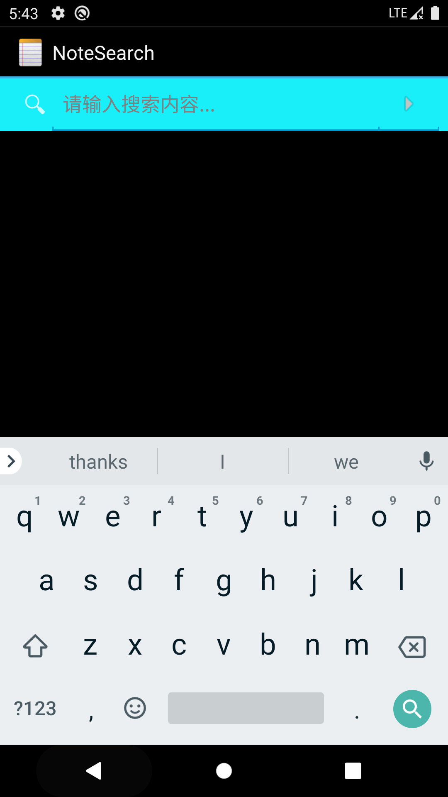
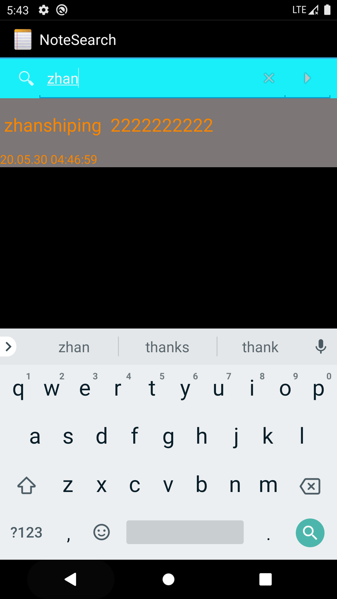
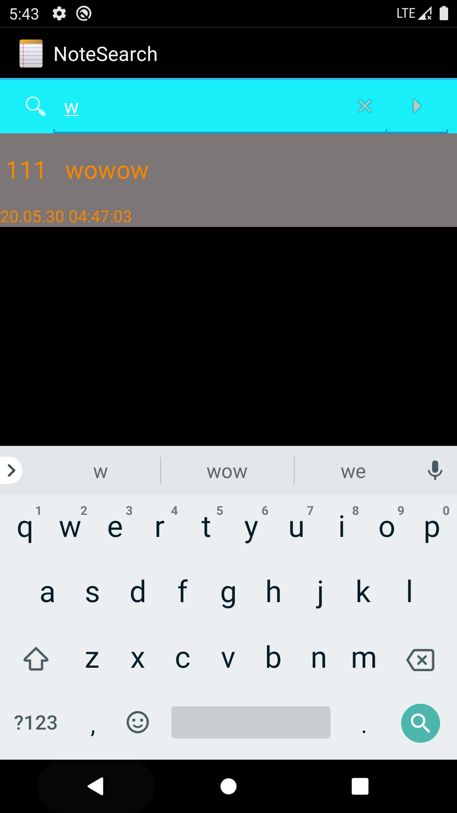
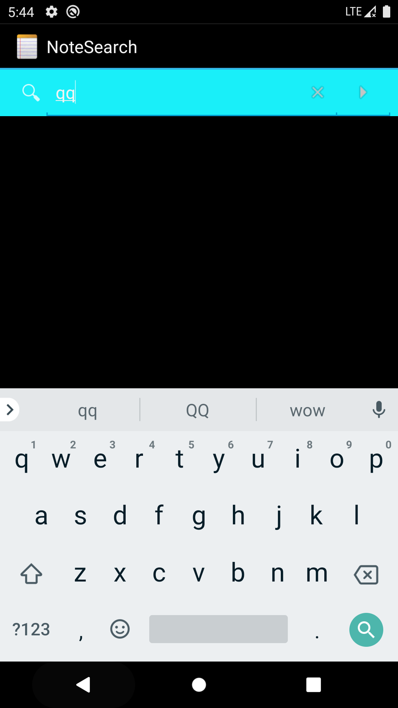

# 基于NotePad 应用做功能扩展

## 基本要求：

### 1、NoteList中显示条目增加时间戳显示

### 2、添加笔记查询功能（根据标题查询）


## 实验过程：

### 1、NoteList中显示条目增加时间戳显示

（1）NotePadPrivoder中已存在创建时间COLUMN_NAME_CREATE_DATE和修改时间COLUMN_NAME_MODIFICATION_DATE，不用再操作

```
public void onCreate(SQLiteDatabase db) {    
db.execSQL("CREATE TABLE " + NotePad.Notes.TABLE_NAME + " ("            
+ NotePad.Notes._ID + " INTEGER PRIMARY KEY,"            
+ NotePad.Notes.COLUMN_NAME_TITLE + " TEXT,"            
+ NotePad.Notes.COLUMN_NAME_NOTE + " TEXT,"            
+ NotePad.Notes.COLUMN_NAME_CREATE_DATE + " INTEGER,"            
+ NotePad.Notes.COLUMN_NAME_MODIFICATION_DATE + " INTEGER"            + ");");
}
```

（2）时间的显示：对NotePadProvider的insert函数进行修改

```
//设置一下样式yy.MM.dd  HH:mm:ss
SimpleDateFormat formatter = new SimpleDateFormat("yy.MM.dd  HH:mm:ss");
//获取当前时间
Date date = new Date(System.currentTimeMillis());
String dateTime = formatter.format(date);
//用datatime替换now
if (values.containsKey(NotePad.Notes.COLUMN_NAME_CREATE_DATE) == false) {
            values.put(NotePad.Notes.COLUMN_NAME_CREATE_DATE, dateTime);}
if (values.containsKey(NotePad.Notes.COLUMN_NAME_MODIFICATION_DATE) == false) {
            values.put(NotePad.Notes.COLUMN_NAME_MODIFICATION_DATE, dateTime);
        }
```

（3）noteslist_item.xml中增加一个TextView用来显示时间

```
<TextView    
android:id="@+id/text2"
android:layout_width="match_parent"    
android:layout_height="wrap_content"    
android:textAppearance="?android:attr/textAppearanceLarge"    android:textColor="@color/orange"    
android:textSize="15sp"    
/>
```

（4）在NotesList的数据定义中增加修改时间的显示

```
private static final String[] PROJECTION = new String[] {        NotePad.Notes._ID, // 0        
NotePad.Notes.COLUMN_NAME_TITLE, // 1        NotePad.Notes.COLUMN_NAME_MODIFICATION_DATE,//时间的显示};
```

（5）在dataColumns、viewIDs加入参数

```
String[] dataColumns = {        
NotePad.Notes.COLUMN_NAME_TITLE,        NotePad.Notes.COLUMN_NAME_MODIFICATION_DATE} ;
```

```
int[] viewIDs = { android.R.id.text1 ,R.id.text2};
```

（6）最后SimpleCursorAdapter装配：

```

SimpleCursorAdapter adapter                
	= new SimpleCursorAdapter(                
	this,                             
	R.layout.noteslist_item,                        
	cursor,                                           
	dataColumns,                
	viewIDs        
	);
```


 

### 2、添加笔记查询功能（根据标题查询）

（1）上传一张查询的图片@drawable/search，然后在list_options_menu.xml添加一个查询按钮，

这样查询按钮就出来了

```
<item    
	android:id="@+id/menu_search"    
	android:icon="@drawable/search"    
	android:title="@string/menu_search"    
	android:showAsAction="always"    
	/>
```

（2）在NoteList的onOptionsItemSelected函数的switch (item.getItemId())中添加对应menu_search的case，采用隐式intent跳转：

```
case R.id.menu_search:
	startActivity(new Intent(Intent.ACTION_SEARCH,getIntent().getData()));
    return true;
```

（3）在AndroidManifest.xml添加

```
<activity    
	android:name=".NoteSearch"    
	android:label="NoteSearch"    
	>    
	
	<intent-filter>        
	<action android:name="android.intent.action.NoteSearch" />        
	<action android:name="android.intent.action.SEARCH" />        
	<action android:name="android.intent.action.SEARCH_LONG_PRESS" />        	 <category android:name="android.intent.category.DEFAULT" />        
	<data android:mimeType="vnd.android.cursor.dir/vnd.google.note" />             </intent-filter>
</activity>
```

（4）搜索采用SearchView实现，并通过实现implements SearchView.OnQueryTextListener接口来完成查询。

代码见NoteSearch

```
package com.example.android.notepad;
import android.app.ListActivity;
import android.content.Intent;
import android.database.Cursor;
import android.os.Bundle;
import android.widget.SearchView;
import android.widget.SearchView.OnQueryTextListener;
import android.widget.SimpleCursorAdapter;
public class NoteSearch extends ListActivity implements OnQueryTextListener{    	public Cursor mCursor;    
	private SimpleCursorAdapter mAdapter;    
	private SearchView mSearchView;    
	//数据存放的数组    
	private static final String[] PROJECTION = new String[]{            			NotePad.Notes._ID, // 0            
		NotePad.Notes.COLUMN_NAME_TITLE, // 1            							NotePad.Notes.COLUMN_NAME_MODIFICATION_DATE,//在这里加入了修改时间的显示    };    
	@Override    
	protected void onCreate(Bundle savedInstanceState) {
    super.onCreate(savedInstanceState);       	
    setContentView(R.layout.note_search);        
    Intent intent = getIntent();        
    if (intent.getData()==null){            
    	intent.setData(NotePad.Notes.CONTENT_URI);        }        
    	getListView().setOnCreateContextMenuListener(this);        
    	mSearchView = (SearchView)findViewById(R.id.search_view);//注册监听器        	 mSearchView.setIconifiedByDefault(false); //显示搜索的天幕，默认只有一个放大镜图标        
    	mSearchView.setSubmitButtonEnabled(true); //显示搜索按钮 					mSearchView.setBackgroundColor(getResources().getColor(R.color.blue_green)); 
    	//设置背景颜色        
    	mSearchView.setOnQueryTextListener(this);    
    	}    
   private void initDataView(){    }    
   @Override    
   public boolean onQueryTextSubmit(String s) {        return false;    }    
   @Override    
   public boolean onQueryTextChange(String s) {        //Text发生改变时执行的内容        String selection = NotePad.Notes.COLUMN_NAME_TITLE + " Like ? ";//查询条件        String[] selectionArgs = { "%"+s+"%" };//查询条件参数，配合selection参数使用,%通配多个字符        
   Cursor cursor = managedQuery(                
   		getIntent().getData(),           
   		// Use the default content URI for the provider.用于ContentProvider查询的URI，从这个URI获取数据                
   		PROJECTION,                       
   		// Return the note ID and title for each note. and modifcation date.用于标识uri中有哪些columns需要包含在返回的Cursor对象中                
   		selection,                        
   		// 作为查询的过滤参数，也就是过滤出符合selection的数据，类似于SQL的Where语句之后的条件选择                
   		selectionArgs,                    
   		// 查询条件参数，配合selection参数使用                				 	NotePad.Notes.DEFAULT_SORT_ORDER  
   		// Use the default sort order.查询结果的排序方式，按照某个columns来排序      //一个简单的适配器，将游标中的数据映射到布局文件中的TextView控件或者ImageView控件中        			String[] dataColumns = { NotePad.Notes.COLUMN_NAME_TITLE ,  NotePad.Notes.COLUMN_NAME_MODIFICATION_DATE };        
   		int[] viewIDs = { android.R.id.text1 , R.id.text2 };        			SimpleCursorAdapter adapter = new SimpleCursorAdapter(                
   		this,                   //context:上下文                						R.layout.noteslist_item, 
   		//layout:布局文件，至少有int[]的所有视图                
   		cursor,                          
   		//cursor：游标                
   		dataColumns,                     
   		//from：绑定到视图的数据                	
   		viewIDs                          
   		//to:用来展示from数组中数据的视图                                               );        
   	setListAdapter(adapter);        
   	return true;    
   	}
}
```

 

 

 

 

 